## 安装Anaconda3

```
1、双击exe文件
```

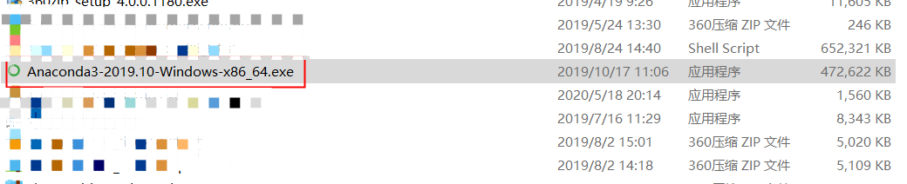

```
2、点击Next
```

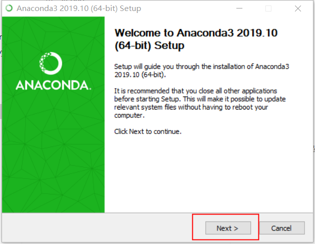

```
3、点击 I Agree
```

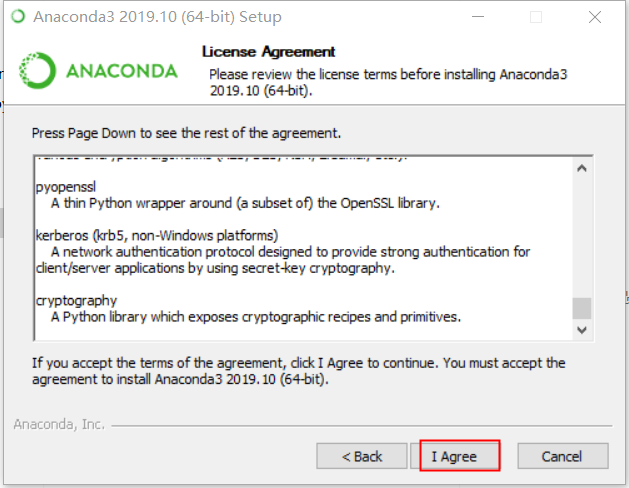

```
4、选择 Just Me，或者 All Users 都可以，点击Next
```

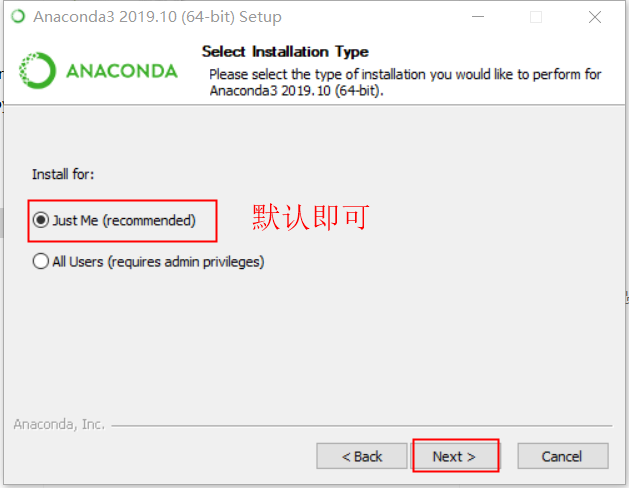

```
5、安装位置选默认即可（修改可能会出错），点击Next
```

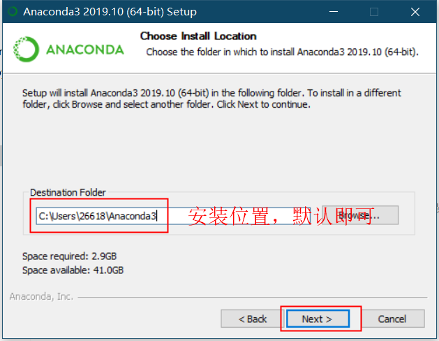

```
6、点击 Install，开始安装文件
```

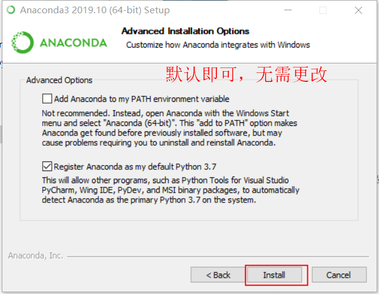

```
7、点击 Next
```

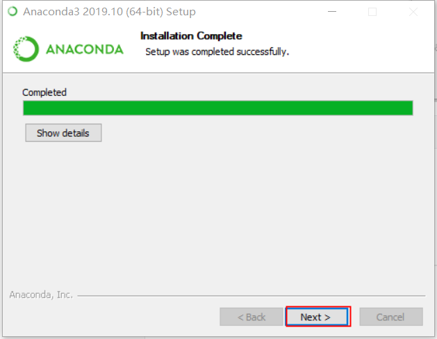

```
8、点击 Next
```

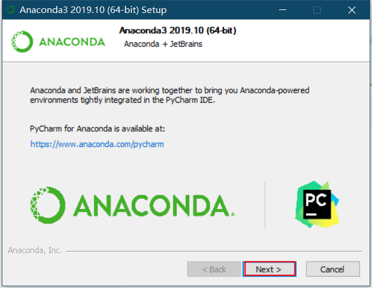

```
9、点击 Finish
```

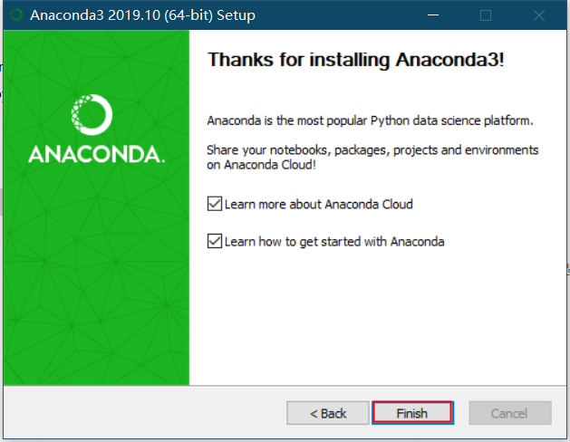

这就安装完啦！步骤也没什么复杂的呀，那要怎么运行呢？小凡问到。

接下运行 Jupyter Notebook 就可以开始学习啦

## 运行Jupyter Notebook

```
在开始菜单中找到安装的Anaconda3，找到Jupyter Notebook快捷键，点击运行。
```

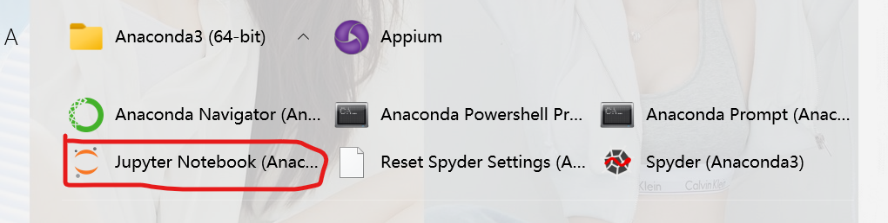

```
运行成功后，会出现以下两个窗口
```

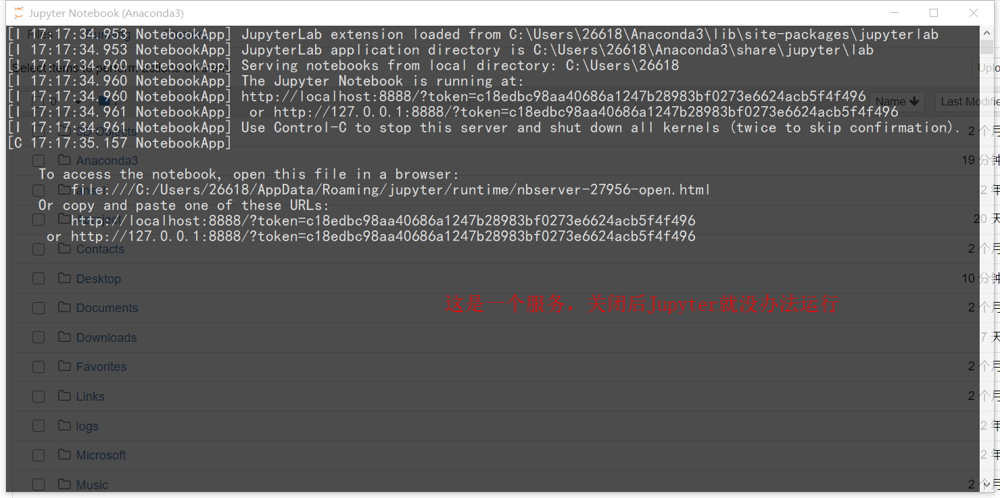

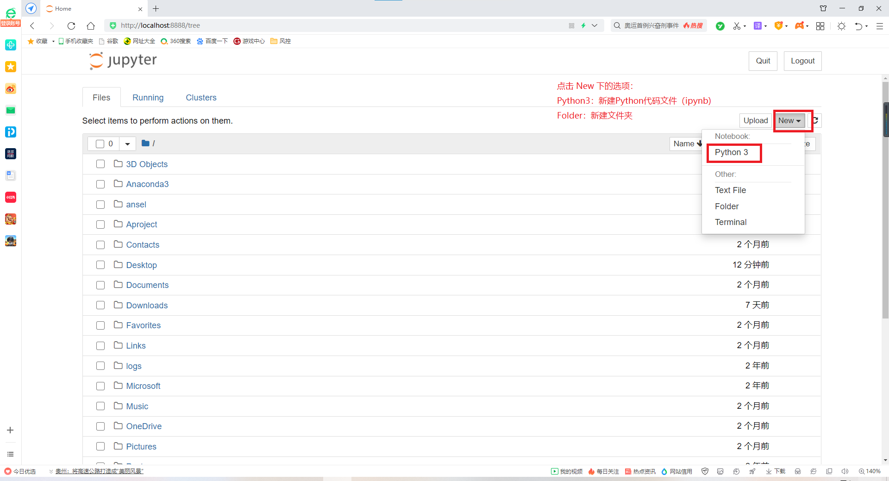

## print与注释

好啦，现在新建一个Python3文件，就可以开始学习Python啦。

```
jupyter界面解释
```

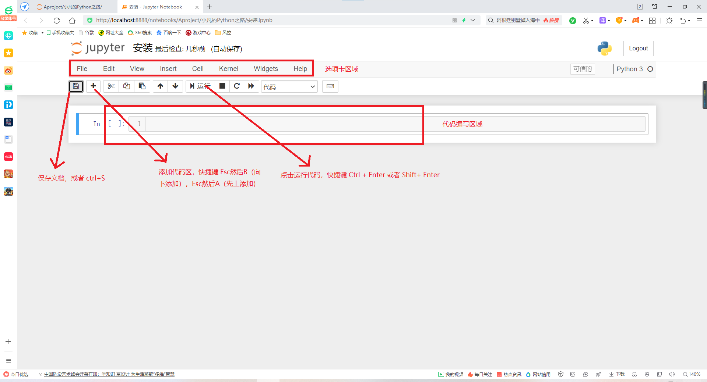

学习一下Python中最常用的一个方法，print()

```Python
print("帅帅的Python")
```

还有就是注释 # ，被注释的代码是不会运行的，就是用来解释代码

```Python
# print("帅帅的Python")
```

