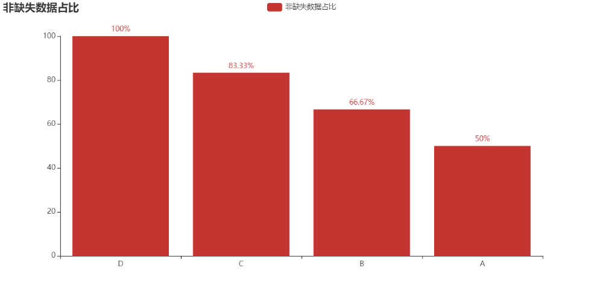

# 获取数据的缺失占比

## 案例分析

在数据建模前，需要查看每一列数据的缺失情况，当缺失值的占比超过一定阈值，就需要考虑，这一列数据（或者这一个变量）是否需要参与建模。一般选用的阈值在0.9，即：当某一个变量的缺失值占比达到90%以上，就需要删除。

这里选用pandas作为主要的数据分析工具，感兴趣的同学可以去[pandas官网](https://pandas.pydata.org/docs/user_guide/10min.html)逛逛，下面开始介绍，如何用pandas查看每一个变量的缺失占比情况，以及绘制出变量缺失分布的柱状图。

### 一、导包

```python
import pandas as pd
import numpy as np
```

### 二、构造数据

```python
df = pd.DataFrame(data={
    "A":[np.nan,np.nan,np.nan,12,13,14],
    "B":[np.nan,np.nan,12,13,14,15],
    "C":[np.nan,12,13,14,15,16],
    "D":[12,13,14,15,16,17],
})
```

### 三、数据样式

```python
      A     B     C   D
0   NaN   NaN   NaN  12
1   NaN   NaN  12.0  13
2   NaN  12.0  13.0  14
3  12.0  13.0  14.0  15
4  13.0  14.0  15.0  16
5  14.0  15.0  16.0  17
```

### 四、查看数据缺失占比

```python
((df.isnull().sum())/df.shape[0]).sort_values(ascending=False).map(lambda x:"{:.2%}".format(x))

A    50.00%
B    33.33%
C    16.67%
D     0.00%
dtype: object
```

可以看到，A变量的缺失值占比为50%，B变量的缺失值占比为33.33%，C变量的缺失值占比为16.67%，D变量缺失值占比为0%。

如果考虑到阈值为0.5，那么A变量就需要删除。关于这段代码的详细步骤，在下面会有解释说明。

### 五、分布柱状图

通过第四步的操作，可以看出数据的缺失占比情况；

这里需要画出数据每一个变量的缺失柱状图，考虑到有些变量没由缺失值，所以这里选用非缺失数据的占比情况，如下：

```python
bar_dict = ((df.notnull().sum())/df.shape[0]).sort_values(ascending=False).to_dict()

# {'D': 1.0, 'C': 0.8333333333333334, 'B': 0.6666666666666666, 'A': 0.5}
```

pyecharts是我在工作中主要使用的可视化工具，所以这里选用pyecharts来绘制分布柱状图。感兴趣的同学可以去[pyecharts官网](https://gallery.pyecharts.org/#/README)逛逛。

这里，为了柱状图的美观，需要对数字的显示格式设置一下，将数据从小数转为百分比数据，设置如下：

```python
label_opts=opts.LabelOpts(is_show=True,formatter='{@y}%')
```

详细绘图代码如下：

```python
from pyecharts.charts import Bar
from pyecharts import options as opts
from pyecharts.globals import _WarningControl
_WarningControl.ShowWarning = False

c = (
    Bar()
    .add_xaxis(list(bar_dict))
    .add_yaxis(
        "非缺失数据占比",
        [round(i*100,2) for i in list(bar_dict.values())],
        label_opts=opts.LabelOpts(is_show=True,formatter='{@y}%'),
    )
    .set_global_opts(title_opts=opts.TitleOpts(title="缺失数据分析"))
)
c.render_notebook()
```

### 六、绘制结果



## 代码详解

```python
((df.isnull().sum())/df.shape[0]).sort_values(ascending=False).map(lambda x:"{:.2%}".format(x))
```

### 1、DataFrame.isnull()

isnull()方法作用于df中的每一个值，如果这个值为NAN，则为True,否则为False，最终返回一个与df有着相同行/列的DataFrame对象。

notnull()方法作用于df中的每一个值，如果这个值为NAN，则为False,否则为True，最终返回一个与df有着相同行/列的DataFrame对象。

```python
# df.isnull()
	   A      B      C      D
0   True   True   True  False
1   True   True  False  False
2   True  False  False  False
3  False  False  False  False
4  False  False  False  False
5  False  False  False  False

# df.notnull()
       A      B      C     D
0  False  False  False  True
1  False  False   True  True
2  False   True   True  True
3   True   True   True  True
4   True   True   True  True
5   True   True   True  True
```

### 2、DataFrame.sum()

求和计算，常用的参数

axis：求和方向，1表示求每一行的和，0表示求每一列的和。（默认为0）

```python
# df.sum()
A    39.0
B    54.0
C    70.0
D    87.0
dtype: float64

# df.sum(axis=1)
0    12.0
1    25.0
2    39.0
3    54.0
4    58.0
```

### 3、DataFrame.shape

获取行和列，返回元组（行，列）

```python
# df.shape
(6, 4)
```

### 4、DataFrame.sort_values()

按照某一字段排序

by：按照某一列的数据排序，

ascending：False为降序，True为升序，（默认为True）

### 5、pandas.Series.map()

map方法，经常与lambda表达式连用，类似的操作还有：pandas.apply()；pandas.applymap()；

```python
# 将每一个小数值变为百分比
pandas.Series.map(lambda x:"{:.2%}".format(x))
```

