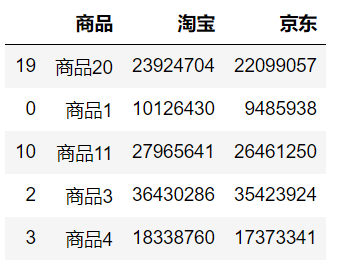
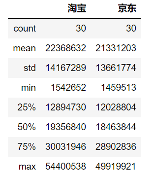
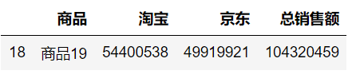
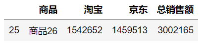
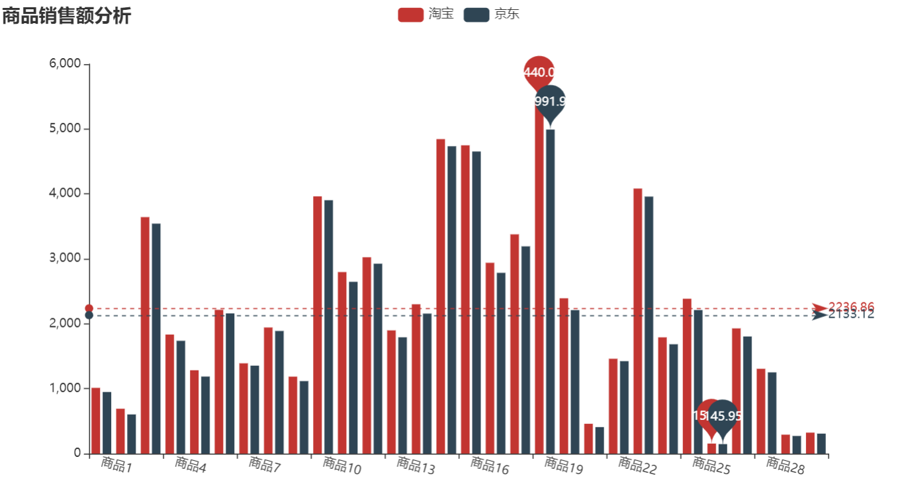

本文分享知识：

> 1. os 模块获取上一级目录的绝对地址
> 2. pands 读取 sqlite3 数据库中的数据
> 3. 将 pandas 中显示为科学计数法的数据修改为正常显示
> 4. pandas 对一列数据求最大值、最小值、求和操作
> 5. pyecharts 绘制柱状图

**关注微信公众号《帅帅的Python》，后台回复《数据分析》获取数据及源码**


## 项目背景

"小凡，上个月的商品销售数据你简单分析一下，等会发我？" 经理走到小凡身边问到

"好的，我下午发您"，小凡一边说着，一边打开 jupyter 开始操作

### 读取数据

小凡常用的数据分析工具是 pandas、numpy ，连接数据库常用的工具是 sqlalchemy


```python
import pandas as pd
import numpy as np
from sqlalchemy import create_engine
import os
```

数据放在上一级的目录下名为 data.db 的文件


```python
# 数据库地址：数据库放在上一级目录下
db_path = os.path.join(os.path.dirname(os.getcwd()),"data.db")
engine_path = "sqlite:///"+db_path
```


```python
# 获取数据函数，根据输入的SQL语句返回 DataFrame 类型数据
def link_sqlite(sql):
    engine = create_engine(engine_path)
    df = pd.read_sql(sql,con=engine)
    return df
```


```python
sql = "select * from salesSummary"
df = link_sqlite(sql)
```

### 数据描述


```python
df.shape
# (30, 3)
```

数据维度为 30 行 3 列，我们随机查看5条数据：


```python
df.sample(5)
```



该数据描述的是30个商品上个月在淘宝、京东的销售额（元）情况，简单看一下数据的分布情况：


```python
# 数据分布
df.describe()
```


该方法返回的是数据的数量、均值、最大值、最小值、分位数信息，但是 pandas 用科学记数法显示的数据，无法直观看到数据，通过下面方法可以设置修改 pandas 的默认显示方式


```python
np.set_printoptions(suppress=True)
pd.set_option("display.float_format",lambda x:"%.f"%x)
df.describe()
```



统计一下每个商品的总销售额、每个店铺的最大、最小销售额数据


```python
# 添加一列总销售额
df["总销售额"] = df["淘宝"]+df["京东"]
# 淘宝店总销售额
df["淘宝"].sum()
# 671058957

# 京东店总销售额
df["京东"].sum()
# 639936097
```


```python
# 销售额最高的商品
df[df["总销售额"]==df["总销售额"].max()]
```




```python
# 销售额最低的商品
df[df["总销售额"]==df["总销售额"].min()]
```




### 柱状图对比

小凡常用的绘图工具为 pyecharts ，用下面代码绘制出商品在淘宝、京东的销售柱状图


```python
from pyecharts import options as opts
from pyecharts.charts import Bar

x_names = df["商品"].tolist()
tao_bao = [round(x/10000,2) for x in df["淘宝"].tolist()]
jing_dong = [round(x/10000,2) for x in df["京东"].tolist()]

c = (
    Bar()
    .add_xaxis(x_names)
    .add_yaxis("淘宝", tao_bao)
    .add_yaxis("京东", jing_dong)
    .set_global_opts(
        xaxis_opts=opts.AxisOpts(axislabel_opts=opts.LabelOpts(rotate=-15)),
        title_opts=opts.TitleOpts(title="商品销售额分析"),
    )
    .set_series_opts(
        label_opts=opts.LabelOpts(is_show=False),
        markpoint_opts=opts.MarkPointOpts(
            data=[
                opts.MarkPointItem(type_="max", name="最大值"),
                opts.MarkPointItem(type_="min", name="最小值"),
            ]
        ),
        markline_opts=opts.MarkLineOpts(
            data=[
                opts.MarkLineItem(type_="average", name="平均值"),
            ]
        ),
    )
)
c.render_notebook()
```



### 分析报告

上个月销售的30件商品中：

> 淘宝店总销售额为：6亿7千万；
> 京东店总销售额为：6以4千万；
> 最高的销售额商品为：商品19，总销售额为1亿；
> 最低的销售额商品为：商品26，总销售额为3百万；

小凡将数据分析的结果整理好制作成 word 文档发给经理。

过了一会儿，经理找到小凡，让小凡帮忙预测一下，下个月商品的销售额是多少？给出一个大概的区间即可。