## 第三章：用python实现简单、实用的用户分层模型——RFM模型

本文可以学习到以下内容：
>1. RFM 模型的原理及代码实现
>2. 使用 pandas 中的 read_sql 读取 sqlite 中的数据
>3. 使用 map 方法计算距离用户上次消费所过去的天数
>4. 使用 groupby+agg 方法统计消费频次、消费总金额
>5. 使用 merge 方法合并 datafram 数据
>6. 使用 quantile 方法计算用户消费数据的分位数
>7. 使用 cut 方法将消费数据划分不同的区间，并打上不同的标签
>8. 使用 value_counts 方法统计各个用户标签的数据量及占比
>9. 使用 pyecharts 绘制环形图

**关注微信公众号《帅帅的Python》，后台回复《数据分析》获取数据及源码**


## 项目背景


## 读取数据

小凡常用的数据分析工具：
```python
import os
import datetime
import numpy as np
import pandas as pd
from sqlalchemy import create_engine
```

数据放在上一级的目录下名为 data.db 的文件
```python
# 数据库地址：数据库放在上一级目录下
db_path = os.path.join(os.path.dirname(os.getcwd()), "data.db")
engine_path = "sqlite:///" + db_path
# 创建数据库引擎
engine = create_engine(engine_path)

# sql 语句
sql = """
select * from business
"""
# read_sql 获取数据
df = pd.read_sql(sql,engine)
# 随机展示 5 
df.sample(5)
```

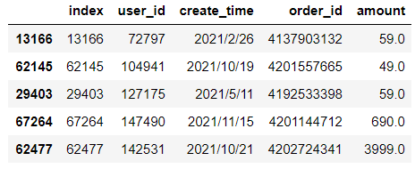

> user_id：用户唯一id字段
>
> create_time：订单创建时间
>
> order_id：订单id
>
> amount：订单金额

```python
df.info()
```

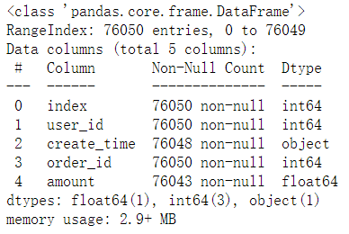

数据有空值，需要删除

```python
# create_time和amount有缺失值，去掉缺失值
df2 = df.copy()

# dropna() 默认只要该行有 nan 值就删除
df2 = df2.dropna()

df2.info()
```

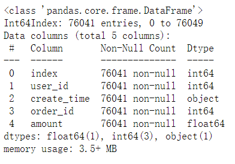

```python
# 查看数据量
len(df2.user_id.unique())
# 55540
```


## 数据分析

### 分析 Recent

> 最近一次消费数据


```python
now_ = pd.to_datetime(datetime.datetime.now())
# 添加时间差数据
df2["recent"] = df2["create_time"].map(lambda x:(now_-pd.to_datetime(x)).days)

df2.sample(5)
```
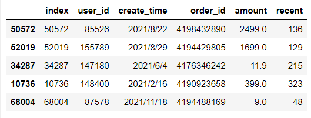
```python
# 用户最近一次购买商品的时间
recent_df = df2.groupby(by="user_id",as_index=False).agg({"recent":"min"})
```

### 分析 Frequency

> 一段时间内的消费次数


```python
frequency_df = df2.groupby(by="user_id",as_index=False).agg({"order_id":"count"})
frequency_df.sort_values(by="order_id",ascending=False).head()
```

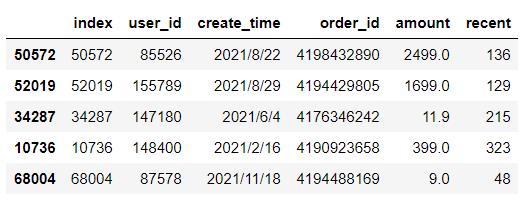

### 分析 Mount

> 一段时间内的消费总金额


```python
mount_df = df2.groupby(by="user_id",as_index=False).agg({"amount":"sum"})
mount_df.sort_values(by="amount",ascending=False).head()
```

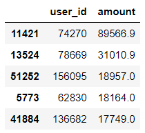

## RFM模型


```python
# 根据 user_id 合并数据
rfm_df = recent_df.merge(
    frequency_df,on="user_id",how="left"
).merge(
    mount_df,on="user_id",how="left"
)
rfm_df2 = rfm_df.copy()
rfm_df2.head()
```

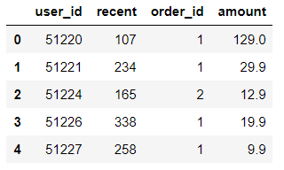

### 根据分位数分层


```python
mount_labels = [1,2,3,4,5]
m_bins = rfm_df2["amount"].quantile(q=np.linspace(0,1,num=6),interpolation='nearest')

recent_labels = [5,4,3,2,1]
r_bins = rfm_df2["recent"].quantile(q=np.linspace(0,1,num=6),interpolation='nearest')

rfm_df2["R"] = pd.cut(rfm_df2["recent"],bins=r_bins,labels=recent_labels,include_lowest=True)

rfm_df2["M"] = pd.cut(rfm_df2["amount"],bins=m_bins,labels=mount_labels,include_lowest=True)

rfm_df2.head()
```

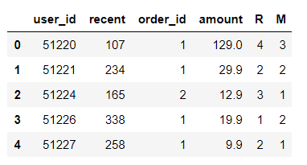


### 自定义分层


```python

```


```python
frequency_bins = [1,3,5,12]
frequency_labels = [1,2,3]

rfm_df2["F"] = pd.cut(
    rfm_df2["order_id"]
    ,bins=frequency_bins
    ,labels=frequency_labels
    ,include_lowest=True
)

rfm_df2.sample(5)
```

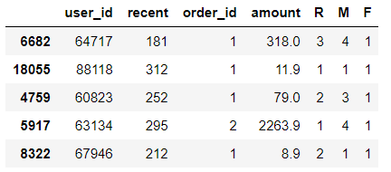

### 打标签


```python
rfm_df2 = rfm_df2.astype(int)
rfm_df2["RFM"] = rfm_df2["R"]*3+rfm_df2["F"]*2+rfm_df2["M"]*5

rfm_bins =rfm_df2["RFM"].quantile(q=np.linspace(0,1,num=6),interpolation='nearest').unique()
rfm_labels = ['流失客户','一般维持客户','重要挽留客户','重要唤回客户','重要价值客户']

rfm_df2["客户标签"] = pd.cut(
    rfm_df2["RFM"],
    bins=rfm_bins,
    labels=rfm_labels,
    include_lowest=True,
    duplicates="drop"
)

rfm_df2["客户标签"].value_counts()
```

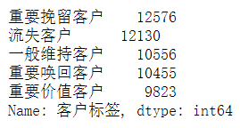


## 数据可视化


```python
from pyecharts import options as opts
from pyecharts.charts import Pie
from pyecharts.faker import Faker

i = rfm_df2["客户标签"].value_counts().index.tolist()
v = rfm_df2["客户标签"].value_counts().values.tolist()
c = (
    Pie()
    .add(
        "",
        [list(z) for z in zip(i, v)],
        radius=["30%", "75%"],
    )
    .set_global_opts(
        title_opts=opts.TitleOpts(title="客户分层占比"),
        legend_opts=opts.LegendOpts(orient="vertical", pos_top="15%", pos_left="2%"),
    )
    .set_series_opts(label_opts=opts.LabelOpts(formatter="{b}: {d}%"))
)
c.render_notebook()
```
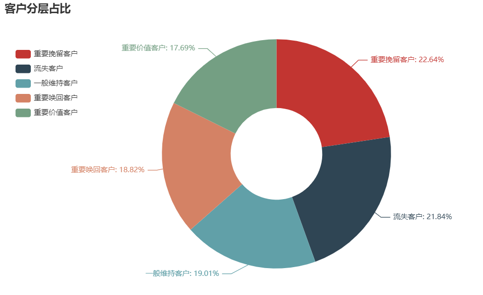

```python
rfm_df2.groupby(by="客户标签",as_index=False).agg({"amount":"sum"})
```

