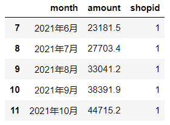
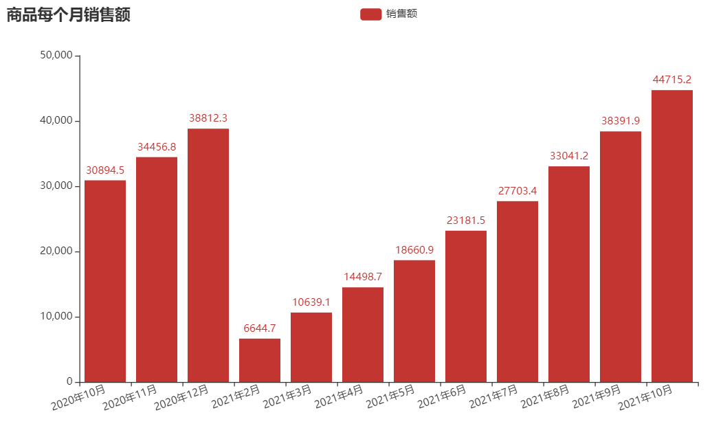
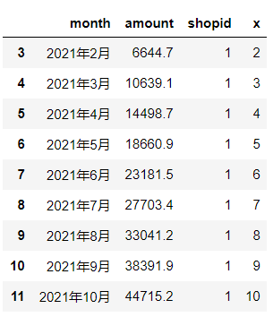
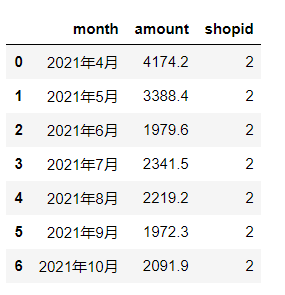
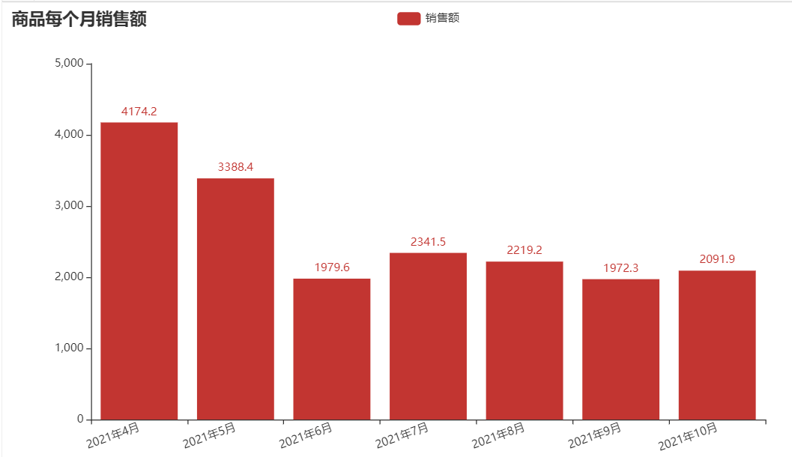

本文分享知识：

> 1. os 模块获取上一级目录的绝对地址
> 2. pands 读取 sqlite3 数据库中的数据
> 3. 用sklearn中的线性回归模型预测销售额数据
> 4. pyecharts 绘制柱状图

**关注微信公众号《帅帅的Python》，后台回复《数据分析》获取数据及源码**


### 项目背景

对于商品的销售额预测，小凡之前尝试过许多方法，比如：时间序列模型、线性回归模型等。

使用模型进行数据预测，需要考虑的因素有很多，需要耗费很大的精力，而且效果也不一定好，这里小凡总结了一些简单的方法以供参考：

> 1、根据销售额的柱形图判断是否需要模型
>
> 2、根据任务的重要性决定模型的复杂度
>
> 3、近3个月的加权平均值是最好的选择

小凡常用的数据分析工具是 pandas、numpy ，连接数据库常用的工具是 sqlalchemy

```python
import numpy as np
import pandas as pd
from sqlalchemy import create_engine
import os
```

### 获取数据

所使用的数据均放在 data.db 中，代码的上一级目录


```python
# 数据库地址：数据库放在上一级目录下
db_path = os.path.join(os.path.dirname(os.getcwd()),"data.db")
engine_path = "sqlite:///"+db_path
# 获取数据函数，根据输入的SQL语句返回 DataFrame 类型数据
def link_sqlite(sql):
    engine = create_engine(engine_path)
    df = pd.read_sql(sql,con=engine)
    return df
```

### 线性数据预测

小凡绘制出所有商品的柱状图后，观察这些柱状图发现：

shapid为1的商品在最近9个月内有上升的趋势，适合用线性回归来预测数据


```python
sql = "select * from predictSalesSummary where shopid=1"
df = link_sqlite(sql)
df.tail()
```




```python
from pyecharts import options as opts
from pyecharts.charts import Bar

x_names = df["month"].tolist()
tao_bao = df["amount"].tolist()

c = (
    Bar()
    .add_xaxis(x_names)
    .add_yaxis("销售额", tao_bao)
    .set_global_opts(
        xaxis_opts=opts.AxisOpts(axislabel_opts=opts.LabelOpts(rotate=20)),
        title_opts=opts.TitleOpts(title="商品每个月销售额"),
    )
)
c.render_notebook()
```




```python
# 从2021年2月份开始，数据呈现上升的线性趋势
df2 = df.iloc[3:,:]

# 数据复制一份，避免操作失误导致数据受损
df3 = df2.copy()
# 将月份作为自变量
df3["x"] = list(range(2,11))

df3
```




```python
from sklearn import linear_model
from sklearn.metrics import mean_squared_error,r2_score

# 自变量数据
x = df3["x"].values.tolist()
# 因变量数据
y = df3["amount"].values.tolist()
# 由于自变量只有一个维度，需要改变一下数据结构
x_reshape = np.array(x).reshape(-1,1)
# 实例化一个线性模型
lr = linear_model.LinearRegression()
# 训练数据
lr.fit(x_reshape,y)
# 预测数据
x_predict = np.array([11]).reshape(-1,1)
lr.predict(x_predict)
# array([47636.39166667])
```

线性模型预测shopid为 1 的商品在2021年11月的销售额为47636万元，结合10月份的销售数据来看，11月份的销售额在 [44715,47636] 之间

### 非线性数据预测

shopid为2的商品，在近5个月有升有降的，用模型预测会耗费很大的精力，所以采用加权平均值代替预测值的方法


```python
shop_2_sql = "select * from predictSalesSummary where shopid=2"
shop_2_df = link_sqlite(shop_2_sql)
shop_2_df
```




```python
from pyecharts import options as opts
from pyecharts.charts import Bar

x_names = shop_2_df["month"].tolist()
tao_bao = shop_2_df["amount"].tolist()

c = (
    Bar()
    .add_xaxis(x_names)
    .add_yaxis("销售额", tao_bao)
    .set_global_opts(
        xaxis_opts=opts.AxisOpts(axislabel_opts=opts.LabelOpts(rotate=20)),
        title_opts=opts.TitleOpts(title="商品每个月销售额"),
    )
)
c.render_notebook()
```



8月份、9月份、10月份的权重为0.2,0.2,0.6，计算得出11月份的销售额为2093万元，结合10月份的销售数据来看，11月份的销售额在 [2091,2094] 之间


```python
np.sum(shop_2_df.iloc[4:,1]*np.array([0.2,0.2,0.6]))
# 2093.44
```


```python
shop_2_df.iloc[4:,1].mean()
# 2094.47
```

