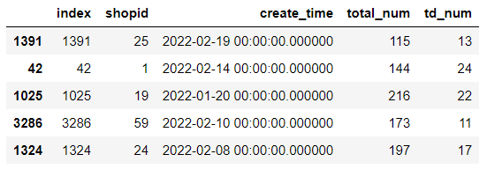
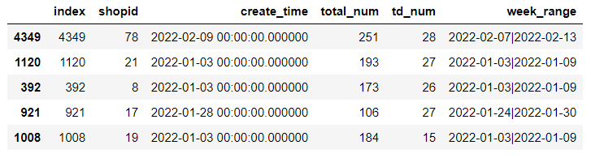
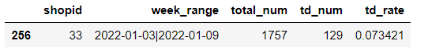
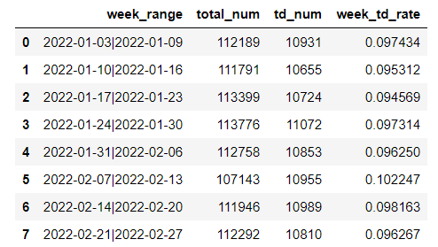
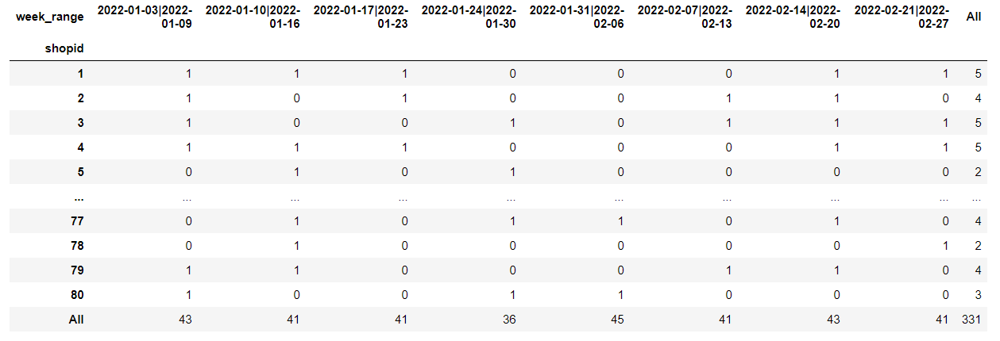
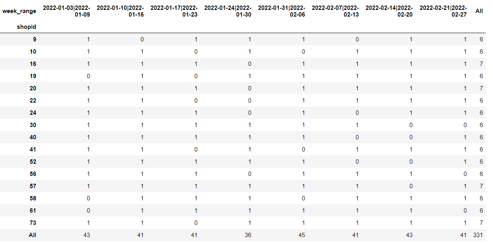

## 第五章：用Python分析商品退单数据并找出异常商品

本文可以学习到以下内容：

>1. 使用 pandas 中的 read_sql 读取 sqlite 中的数据
>2. 获取指定的日期的周一和周日
>4. 使用 groupby+agg 方法统计每周的商品总销量和总退单量
>5. 使用 value_counts 方法统计商品的退单数据
>6. 使用 merge 方法合并数据

**关注微信公众号《帅帅的Python》，后台回复《数据分析》获取数据及源码**


### 项目背景

早上刚到公司，小凡就被叫去开晨会。

这么早，肯定有大事要发生。偌大的会议室，挤满了各个部门的人......

"最近公司的商品退单率很高，给公司造成了损失，各个部门汇报一下最近工作"，总经理端坐着，一边听各部门负责人的报告，一边记录着。

接下来就是长达2个小时的报告......

总经理给各个部门分配好任务，这次的任务直接影响年终奖的金额，要求各部门认真负责，积极配合，高效的解决这次危机。

散会后，经理给小凡安排工作。

"小凡，你把最近2个月的商品退单情况整理一下，下午我和业务部门开会要用"，经理安排好，就急匆匆的离开啦。

小凡了解到，退单率是由部分商品引起的，所以小凡需要根据最近2个月的数据，找出退单率高的异常商品。

接杯水后，小凡有了思路：

> 将2个月分为8周，在这8周内，统计每周的商品退单率排名
>
> 如果商品退单率排名超过5次排名靠前，那么就定义为异常商品

新的一天，从敲代码开始！

### 获取数据

```python
import os
import pandas as pd
import numpy as np
from sqlalchemy import create_engine
from datetime import datetime,timedelta

# 数据库地址：数据库放在上一级目录下
db_path = os.path.join(os.path.dirname(os.getcwd()), "data.db")
engine_path = "sqlite:///" + db_path
# 创建数据库引擎
engine = create_engine(engine_path)

sql = """
select 
*
from
shopRefuse
"""

df = pd.read_sql(sql, engine)

df2.sample(5)
```



> shopid：商品id
>
> create_time：商品订单创建时间
>
> total_num：当天总销售商品数
>
> td_num：当天销售商品退单数

### 数据计算

根据商品的创建时间获取当天对应的周一和周日，函数如下：


```python
def get_monday_to_sunday(today, weekly=0):
    """
    :function: 获取指定日期的周一和周日的日期
    :param today: '2021-11-16'; 当前日期：today = datetime.now().strftime('%Y-%m-%d')
    :param weekly: 获取指定日期的上几周或者下几周，weekly=0当前周，weekly=-1上一周，weekly=1下一周
    :return: 返回指定日期的周一和周日日期
    :return_type: tuple
    """
    last = weekly * 7
    today = datetime.strptime(str(today), "%Y-%m-%d")
    monday = datetime.strftime(today - timedelta(today.weekday() - last), "%Y-%m-%d")
    monday_ = datetime.strptime(monday, "%Y-%m-%d")
    sunday = datetime.strftime(monday_ + timedelta(monday_.weekday() + 6), "%Y-%m-%d")
    return "{0}|{1}".format(monday, sunday)
```

**将数据重新拷贝一份，避免操作失误导致数据重跑**


```python
df2 = df.copy()
# 为新数据添加周维度数据
df2["week_range"] = df2["create_time"].map(lambda x:get_monday_to_sunday(str(x)[:10]))
df2.sample(5)
```



根据新增的周维度数据，统计每周商品的退单率：


```python
td_rate_df = df2.groupby(by=["shopid","week_range"],as_index=False).agg({"total_num":"sum","td_num":"sum"})
td_rate_df["td_rate"] = td_rate_df["td_num"]/td_rate_df["total_num"]
td_rate_df.sample(1)
```



统计每周总体的退单率：


```python
week_td_rate_df = df2.groupby(by="week_range",as_index=False).agg({"total_num":"sum","td_num":"sum"})

week_td_rate_df["week_td_rate"] = week_td_rate_df["td_num"]/week_td_rate_df["total_num"]

week_td_rate_df
```



### 统计次数

统计每周高于均值的商品的次数：


```python
merge_df = pd.merge(
    td_rate_df,week_td_rate_df[["week_range","week_td_rate"]],
    on="week_range",
    how="left"
)

merge_df["td_count"] = merge_df[["td_rate","week_td_rate"]].apply(lambda x:0 if x[0]<=x[1] else 1,axis=1)

result_df = merge_df.pivot_table(index="shopid",columns="week_range",values="td_count",margins=True,aggfunc=lambda x:x.sum())

result_df
```



### 异常商品

将超过5次退单率的商品定义为异常商品：


```python
unnormal_shop_df = result_df[result_df["All"]>5]
unnormal_shop_df
```



小凡将数据保存为excel文件，方便后续的数据展示。

下午5点左右，小凡和经理一起参加业务部门的会议，小凡的分析思路得到了一致的认可。


