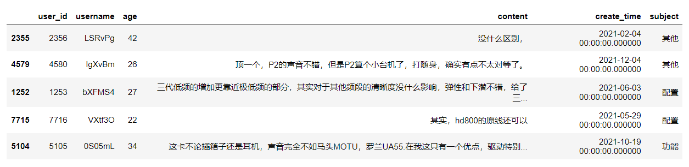
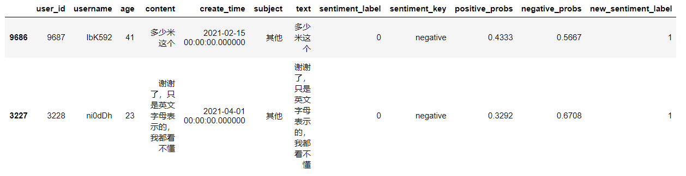
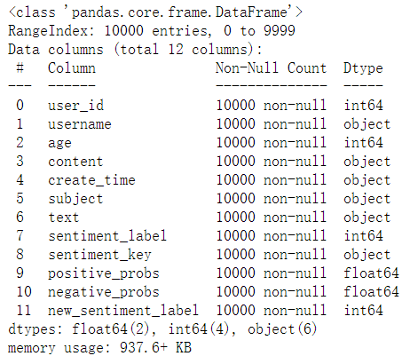
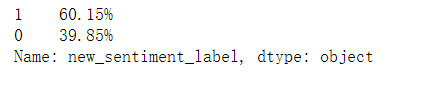
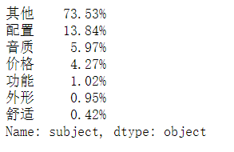
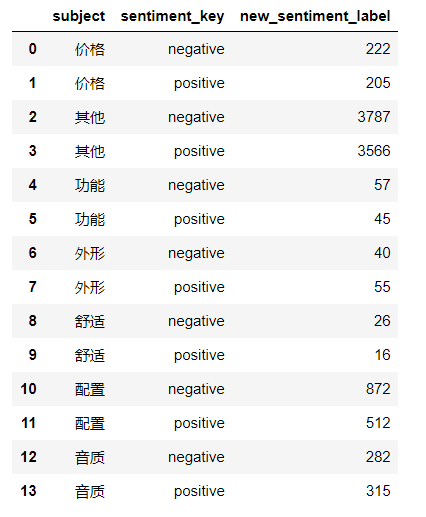
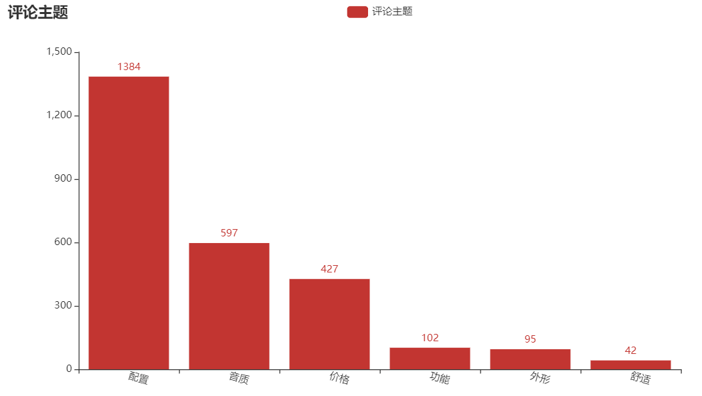

## 第四章：用Python对用户的评论数据进行情感倾向分析

本文可以学习到以下内容：

>1. 使用 pandas 中的 read_sql 读取 sqlite 中的数据
>2. 使用飞浆模型 senta_bilstm 对评论数据进行情感划分
>3. 使用飞浆模型 lac 对评论数据进行分词
>4. 使用 groupby+agg 方法统计评论主题中消极和积极用户分布
>5. 使用 value_counts 方法统计整体评论分布情况
>6. 使用 pyecharts 绘制柱状图、词云图

**关注微信公众号《帅帅的Python》，后台回复《数据分析》获取数据及源码**


## 项目背景

小凡，

### 获取数据

```python
import os
import pandas as pd
import numpy as np
from sqlalchemy import create_engine

# 数据库地址：数据库放在上一级目录下
db_path = os.path.join(os.path.dirname(os.getcwd()), "data.db")
engine_path = "sqlite:///" + db_path
# 创建数据库引擎
engine = create_engine(engine_path)

sql = """
select 
a.user_id
,a.username
,a.age
,b.content
--,b.sentiment_value
,b.create_time
,b.subject
from
users as a
left join
comment as b
on a.user_id=b.user_id
"""

df = pd.read_sql(sql, engine)

df.sample(5)
```



数据解释：

> user_id：用户id
>
> username：用户名
>
> age：年龄
>
> content：评论内容
>
> sentiment_value：情感值【0消极，1积极，-1未知】（用飞浆重写训练得到情感值）
>
> create_time：评论时间
>
> subject：评论主题

### 情感倾向

用百度飞浆（paddlepaddle）模型库中的情感分析模型，将评论数据（content）转化为情感类别【积极1，消极0】

#### senta_bilstm 模型

一、window10+anaconda3的安装命令：

```shell
conda install paddlepaddle==2.2.1 --channel https://mirrors.tuna.tsinghua.edu.cn/anaconda/cloud/Paddle/
```

> 其他安装飞浆命令：[官网地址](https://www.paddlepaddle.org.cn/install/quick?docurl=/documentation/docs/zh/install/conda/windows-conda.html)
>

二、安装预训练模型应用工具 PaddleHub

```shell
pip install paddlehub==2.0.0
```

> 飞浆模型库地址：[官网地址](https://www.paddlepaddle.org.cn/hublist)
>
> 飞浆情感分析模型介绍：[官网地址](https://www.paddlepaddle.org.cn/hubdetail?name=senta_bilstm&en_category=SentimentAnalysis)


```python
import paddlehub as hub

# 加载模型
senta = hub.Module(name="senta_bilstm")

# 评论数据列表
test_text = df["content"].tolist()
# 模型返回的结果
results = senta.sentiment_classify(texts=test_text, use_gpu=False, batch_size=1)

```

#### 情感划分

> 将 negative_probs>=0.7 的定义为消极


```python
# 将返回的结果转为 dataframe 数据，并拼接到原始数据中
results_df = pd.DataFrame(results)

df2 = pd.concat([df,results_df],axis=1)
# 将 negative_probs>=0.7 的定义为消极
df2["new_sentiment_label"] = df2["negative_probs"].map(lambda x: 0 if x>=0.7 else 1)

df2[df2["sentiment_label"]!=df2["new_sentiment_label"]].sample(2)
```



### 数据描述

```python
df2.info()
```



### 数据分析

#### 总体评论倾向


```python
(df2.new_sentiment_label.value_counts(normalize=True)).map(lambda x:"{:.2%}".format(x))
```



大约 60% 的用户给出好评

#### 评论分布


```python
(df2.subject.value_counts(normalize=True)).map(lambda x:"{:.2%}".format(x))
```



用户的评论内容多集中在配置、音质等主题上

#### 各分布的情感倾向


```python
df2.groupby(by=["subject","sentiment_key"],as_index=False).agg({"new_sentiment_label":"count"})
```




```python
from pyecharts import options as opts
from pyecharts.charts import Bar

x_name = ['配置', '音质', '价格', '功能', '外形', '舒适']
y_value = [1384,  597,  427,  102,   95,   42]
c = (
    Bar()
    .add_xaxis(x_name)
    .add_yaxis("评论分布",y_value)
    .set_global_opts(
        xaxis_opts=opts.AxisOpts(axislabel_opts=opts.LabelOpts(rotate=-15)),
        title_opts=opts.TitleOpts(title="评论分布"),
    )
)
c.render_notebook()
```



### 评论分词

这里使用百度飞浆的LAC分词模型

>
> 飞浆LAC分词模型：[官网地址](https://www.paddlepaddle.org.cn/hubdetail?name=lac&en_category=LexicalAnalysis)
>


```python
import paddlehub as hub

# 加载模型
lac = hub.Module(name="lac")
test_text = df["content"].tolist()
# 模型分词结果
results = lac.cut(text=test_text, use_gpu=False, batch_size=1, return_tag=True)
# 将所有分词保存到一个列表中
result_word_list = []
for result in results:
    result_word_list.extend(result["word"])
```


#### 去除停用词


```python
# 停用词数据
with open("./stop_words.txt","r",encoding="utf-8") as f:
    # 用 strip 删除换行符 /n
    stop_word_list = [s.strip() for s in f.readlines()]
```


```python
# 统计每个词出现的次数
word_cloud_dict = {}
for w in result_word_list:
    # 如果在停用词中就不统计
    if w in stop_word_list:
        continue
    if w in word_cloud_dict.keys():
        word_cloud_dict[w] = word_cloud_dict[w]+1
    else:
        word_cloud_dict[w] = 1
```


```python
# 制作词云图的数据
word_cloud_data = sorted(word_cloud_dict.items(),key=lambda x:x[1],reverse=True)
```

#### 绘制词云图


```python
import pyecharts.options as opts
from pyecharts.charts import WordCloud


word_cloud = (
    WordCloud()
    .add(series_name="评论热词", data_pair=word_cloud_data, word_size_range=[6, 66])
    .set_global_opts(
        title_opts=opts.TitleOpts(
            title="评论热词", title_textstyle_opts=opts.TextStyleOpts(font_size=23)
        ),
        tooltip_opts=opts.TooltipOpts(is_show=True),
    )
)
word_cloud.render_notebook()
```


### 结论

